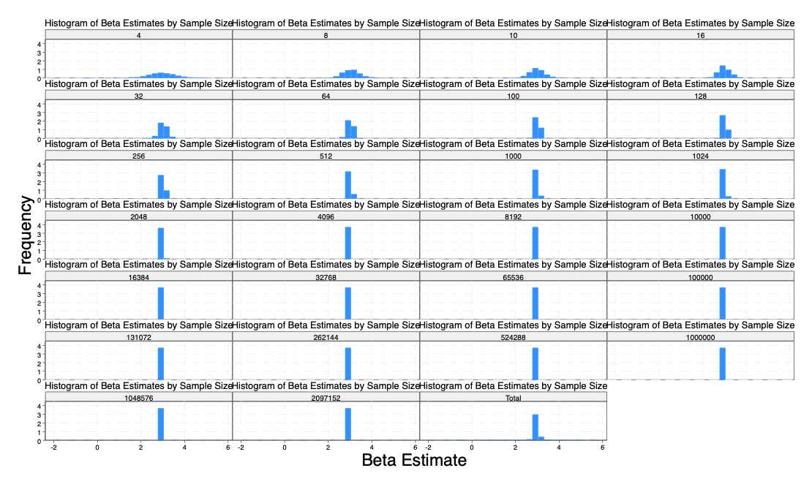
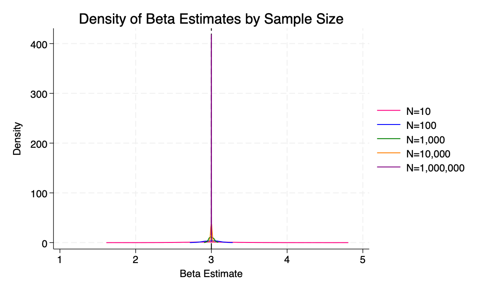

# README: Sampling Noise in a Fixed Population
This assignment explores how sampling noise affects regression estimates when drawing samples from a fixed population. We simulate repeated sampling and regression at different sample sizes (N = 10, 100, 1000, 10000), and examine how estimates, standard errors, and confidence intervals behave.

## Data Generating Process (DGP)

We create a fixed population of 10,000 individuals using the following data generating process:

y_i = 2 + 3*x_i + ε_i

Where:
- x_i ~ N(0, 1) is the independent variable
- ε_i ~ N(0, 1) is the error term
- The true slope (beta) is 3
- The true intercept is 2

This dataset is saved as `q1_fixedpop.dta`.

## Simulation Design

We created a Stata program `sample_regression` that:
1. Loads the fixed population
2. Draws a random sample of size N
3. Runs a regression of y on x
4. Saves the coefficient (beta), standard error, p-value, and confidence interval

Using the simulate command, we ran this program 500 times for each of the following sample sizes:
- N = 10
- N = 100
- N = 1000
- N = 10000

All results were combined into one dataset: `combined_sim_results.dta`.

## Graphs and Interpretation
### 1. Boxplot of Beta Estimates by Sample Size
This graph shows how the distribution of beta estimates varies with N.
### Distribution of Beta Estimates (Boxplot)

Interpretation:
- For N = 10, the beta estimates are highly spread out with more noise and outliers.
- As sample size increases, the estimates become tightly clustered around the true beta = 3.
- The median is stable across groups, confirming the estimator is unbiased.

### 2. Standard Error vs Sample Size
Line graph showing the average standard error of beta at each sample size.

Interpretation:
- The standard error decreases sharply as N increases.
- This reflects the increased precision of the regression estimate with larger samples.

### 3. Confidence Interval Width vs Sample Size
Line graph showing how wide the 95% confidence intervals are, on average.

Interpretation:
- Confidence intervals shrink rapidly with larger sample size.
- Larger samples allow us to make tighter and more reliable inferences.

### 4. Dot Plot of Mean Beta and 95% Confidence Intervals

Dots represent the mean beta estimate at each N, and vertical bars show 95% confidence intervals.
### Mean Beta Estimates with 95% CIs

Interpretation:
- All mean estimates are very close to the true value (beta = 3).
- Confidence intervals get narrower as N increases, showing increased reliability.

### 5. Density Plots of Beta Estimates
Smooth curves show the distribution of beta estimates for each sample size.

Interpretation:
- At N = 10, the distribution is wide and flat.
- At larger sample sizes, the distributions become narrow and tightly centered around 3.
- This visualizes how sampling noise decreases with larger N.

### 6. Summary Table of Simulation Results

| Sample Size | Mean Beta | Std. Dev. Beta | Mean SE | Mean CI Width |
|-------------|-----------|----------------|---------|----------------|
| 10          | 3.0228    | 0.3839         | 0.3604  | 1.6621         |
| 100         | 3.0169    | 0.1065         | 0.1026  | 0.4073         |
| 1000        | 3.0109    | 0.0293         | 0.0321  | 0.1258         |
| 10000       | 3.0101    | ~0             | 0.0101  | 0.0397         |

Interpretation:
- The mean beta is close to the true value across all sample sizes.
- Standard errors and confidence interval widths drop rapidly as N increases.
- The estimates become both accurate and highly precise as N gets larger.
  ### Histogram by Sample Size

## Analysis of Simulation Results

The graphs clearly show how increasing the sample size reduces sampling noise and leads to more precise estimates of the true beta. At small sample sizes like N = 10, the beta estimates are widely dispersed, with large standard errors and wide confidence intervals, making the estimates unreliable. As the sample size increases to 100 and 1,000, the distribution of beta estimates becomes narrower, and the standard error and confidence intervals shrink, reflecting greater precision. However, at N = 10,000, the behavior changes qualitatively—the beta estimates across simulations are almost identical, the standard errors are extremely small, and the confidence intervals are very tight. This suggests that at such a large sample size, sampling noise is virtually eliminated and the estimates consistently recover the true beta. The shift at N = 10,000 highlights how large samples can produce highly stable and replicable results in regression analysis.

## Conclusion

This simulation illustrates how:
- Regression estimates from small samples can vary widely due to sampling noise.
- Larger samples provide greater precision, reflected in smaller standard errors and tighter confidence intervals.
- Even though the estimator is unbiased, small samples are riskier when making inferences.

These findings highlight the importance of adequate sample sizes in applied research. 

# Section 2 

## Part 2: Sampling Noise in an Infinite Superpopulation

### Objective
This section explores how sampling noise behaves when drawing from an infinite superpopulation, using the same linear DGP from Part 1:

**Y = 2 + 3X + ε**, where both **X** and **ε** are drawn from a standard normal distribution.

To simulate this, I created a program that draws new synthetic data each time based on the DGP. I then ran 500 regressions for each of 26 different sample sizes, including the first 20 powers of 2 (from 4 to 2,097,152) and key powers of 10 (10, 100, ..., 1,000,000).

---

### Visualization of Sampling Noise

#### Histogram of Beta Estimates by Sample Size
This set of histograms shows how the distribution of estimated slopes (`β`) becomes tighter and more concentrated around the true value (β = 3) as sample size increases.

At very small sample sizes (e.g., N = 4, 8, 10), estimates are spread widely across the x-axis, showing how noisy regressions can be when based on limited data. By the time N reaches 100,000+, the estimates concentrate almost exclusively around 3, indicating minimal noise.

---

#### Boxplot of Beta Estimates by Sample Size
The boxplot below demonstrates how the spread (variance and IQR) of the beta estimates collapses as N increases.

Small sample sizes show many outliers and wider boxes, while larger samples become highly concentrated. This visualization makes the variance reduction across sample sizes extremely clear.

---

#### Density Plot: Comparing Key Sample Sizes
This density plot overlays the distribution of beta estimates for five key sample sizes. The taller and narrower the curve, the more concentrated and precise the estimates.

By the time we reach N = 1,000,000, the density is sharply peaked around the true value of β = 3, indicating very low sampling variability.

---

### Summary Table of Results
| Sample Size (N) | Mean Beta | Mean SEM | 95% CI Lower | 95% CI Upper | CI Width |
|----------------:|-----------:|----------:|--------------:|--------------:|----------:|
| 4               | 2.9772     | 0.7014    | -0.0416       | 5.9950        | 6.0356    |
| 8               | 3.0263     | 0.4019    | 2.0430        | 4.0097        | 1.9667    |
| 10              | 3.0062     | 0.3521    | 2.1942        | 3.8181        | 1.6240    |
| 16              | 2.9918     | 0.2659    | 2.4214        | 3.5622        | 1.1408    |
| 32              | 3.0121     | 0.1831    | 2.6382        | 3.3860        | 0.7478    |
| 64              | 3.0031     | 0.1271    | 2.7491        | 3.2571        | 0.5080    |
| 100             | 3.0002     | 0.1019    | 2.7980        | 3.2025        | 0.4045    |
| 128             | 2.9899     | 0.0893    | 2.8131        | 3.1667        | 0.3536    |
| 256             | 3.0002     | 0.0627    | 2.8767        | 3.1238        | 0.2471    |
| 512             | 3.0015     | 0.0444    | 2.9142        | 3.0888        | 0.1746    |
| 1000            | 3.0014     | 0.0316    | 2.9394        | 3.0634        | 0.1239    |
| 1024            | 2.9999     | 0.0312    | 2.9386        | 3.0612        | 0.1226    |
| 2048            | 2.9996     | 0.0221    | 2.9563        | 3.0429        | 0.0866    |
| 4096            | 2.9992     | 0.0156    | 2.9686        | 3.0299        | 0.0613    |
| 8192            | 2.9996     | 0.0110    | 2.9780        | 3.0213        | 0.0433    |
| 10000           | 3.0000     | 0.0100    | 2.9804        | 3.0196        | 0.0392    |
| 16384           | 3.0010     | 0.0078    | 2.9857        | 3.0163        | 0.0306    |
| 32768           | 3.0004     | 0.0055    | 2.9896        | 3.0113        | 0.0217    |
| 65536           | 3.0000     | 0.0039    | 2.9924        | 3.0077        | 0.0153    |
| 100000          | 2.9998     | 0.0032    | 2.9936        | 3.0060        | 0.0124    |
| 131072          | 3.0000     | 0.0028    | 2.9946        | 3.0054        | 0.0108    |
| 262144          | 3.0001     | 0.0020    | 2.9963        | 3.0039        | 0.0077    |
| 524288          | 3.0000     | 0.0014    | 2.9972        | 3.0027        | 0.0054    |
| 1000000         | 3.0000     | 0.0010    | 2.9980        | 3.0019        | 0.0039    |
| 1048576         | 2.9999     | 0.0010    | 2.9980        | 3.0018        | 0.0038    |
| 2097152         | 3.0000     | 0.0007    | 2.9987        | 3.0014        | 0.0027    |

---

### Interpretation

These results highlight three key statistical principles:

1. **Unbiasedness**: Across all sample sizes, the mean beta estimates consistently hover around the true value of 3. This confirms that OLS remains unbiased, even for small samples.

2. **Precision Improves with N**: Both standard errors and confidence interval widths shrink substantially as sample size increases. At N = 4, the CI spans more than 6 units. At N = 1,000,000, it shrinks to just 0.0039 — a 1,500x reduction.

3. **Stability at Scale**: Once N exceeds about 10,000, beta estimates become extremely stable across simulations. Sampling noise is virtually eliminated, showing that large samples give both accurate and highly reliable estimates.

---

# Comparison to part 1

